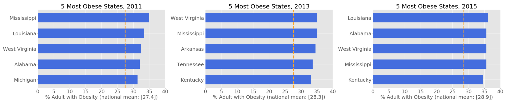
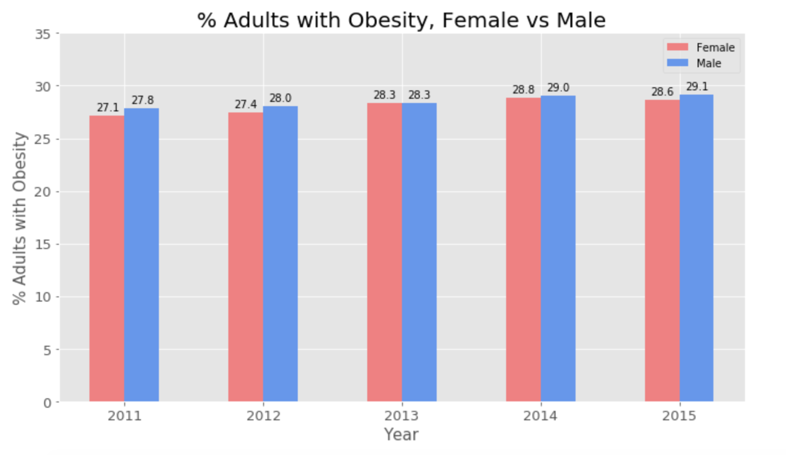
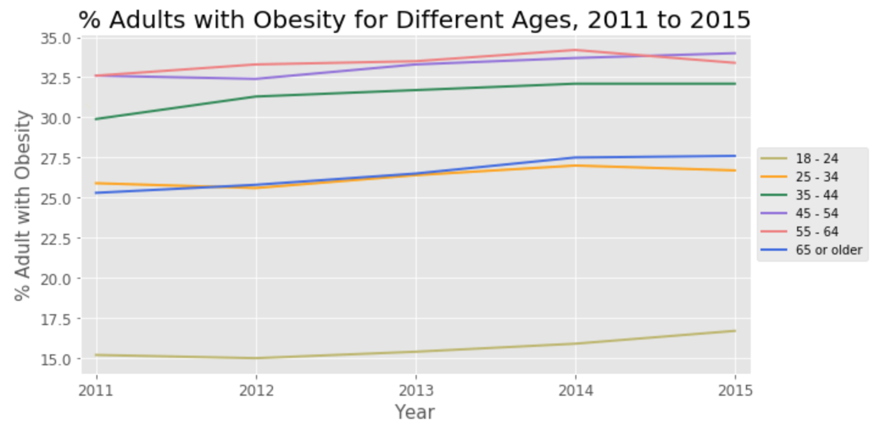
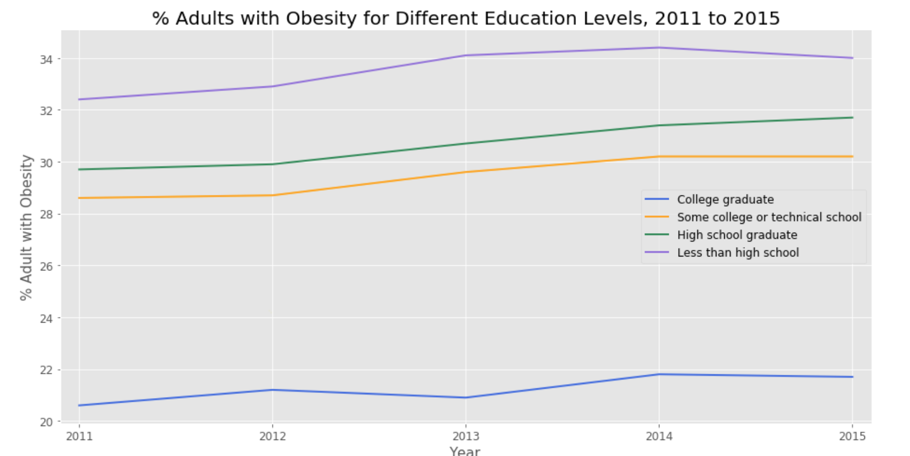

# Obesity in the US

# Goal:

Obesity is linked to many chronic diseases, and as obesity became a national issue, I wanted to look into the trend and identify certain population groups have higher obesity rate than others. 

# Data:

The dataset was obtained from CDC. It reflects information regarding adult's diet, physical activity, and weight status for years 2011-2015. Given that the focus is to look at obesity rates, the data was cleaned to focus on % of adults (18+) who have obesity. 
Dataset had 33 columns, I was interested in the following population groups and how their obesity rate can vary:
- Gender
- Age
- Education Level
- Income Level

# EDA

The dataset was imported into Pandas dataframe and was cleaned to focus on obesity vs the 4 features that I was interested in. 

- First, I wanted to check the top 5 most and least obese states for years 2011 to 2015. 

With the national population obesity rate being 27.4, 28.3, 28.9 for years 2011, 2013, and 2015 respectively, the least obese state since 2011 is Colorado. This could be due to its landscape which motivates people to engage in more physical activities/trainings. While the most obese state has been alternating, it seems to follow the trend that southern states tend to be more obese. Another observation is that the average national population rate is increasing every year.

- Then I looked into gender to see if obesity follows any trend in regards to gender. 

US adult obesity prevelance between 2011 to 2015 for female and male are fairly close to each other. 

- Third feature that was looked into was age groups. 

- Another feature that was looked into was education level. 

Population with less than high school education level has a lot higher obesity prevelance than other education levels. 
