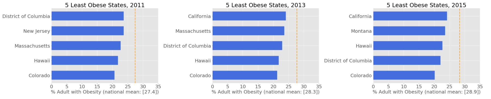

# Obesity in the US

# Goal:

Obesity is linked to many chronic diseases, and as obesity became a national issue, I wanted to look into the trend and identify certain population groups have higher obesity rate than others. 

# Data:

The dataset was obtained from CDC. It reflects information regarding adult's diet, physical activity, and weight status for years 2011-2015. Given that the focus is to look at obesity rates, the data was cleaned to focus on % of adults (18+) who have obesity. 
Dataset had 33 columns, I was interested in the following population groups and how their obesity rate can vary:
- Gender
- Age
- Education Level
- Income Level

# EDA

The dataset was imported into Pandas dataframe and was cleaned to focus on obesity vs the 4 features that I was interested in. 

- First, I wanted to check the top 5 most and least obese states for years 2011 to 2015. 

