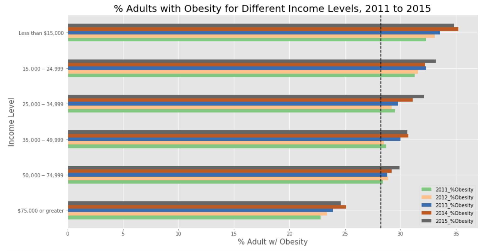
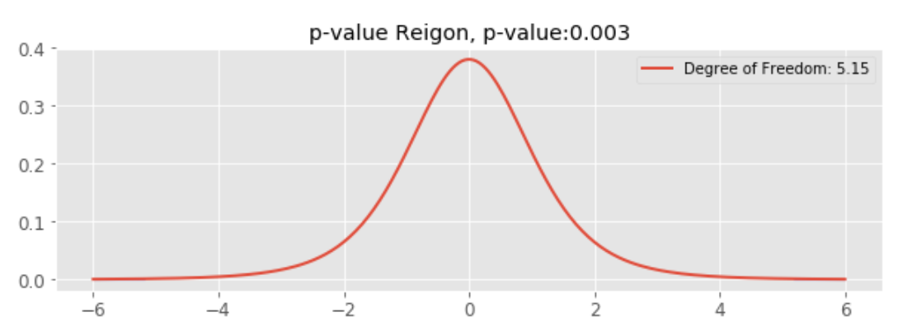
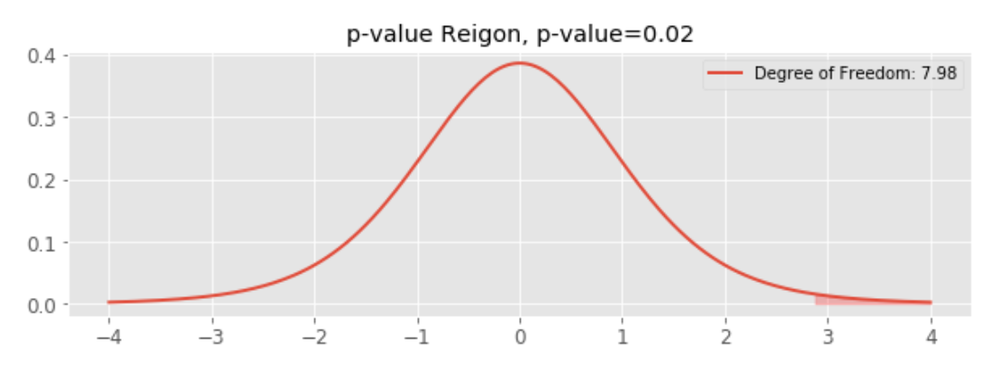
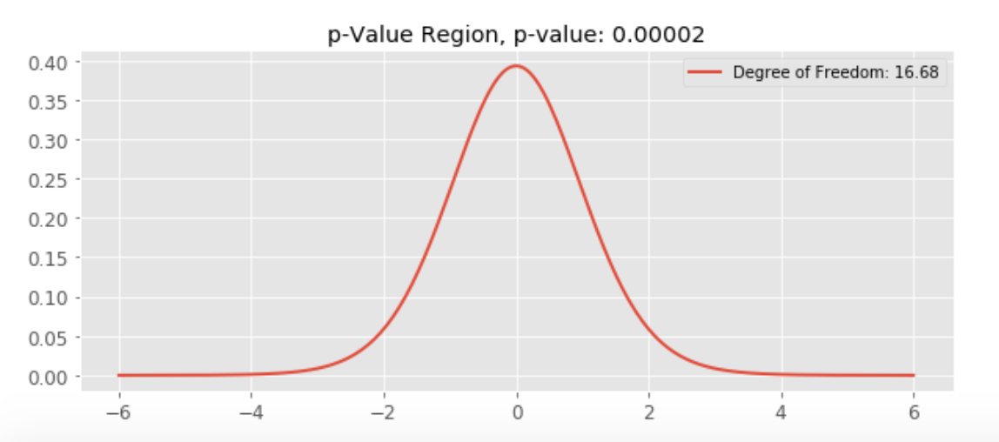

# Obesity in the US

# Goal:

Obesity is linked to many chronic diseases, and as obesity became a national issue, I wanted to look into the trend and identify certain population groups have higher obesity rate than others. 

# Data:

The dataset was obtained from CDC. It reflects information regarding adult's diet, physical activity, and weight status for years 2011-2015. Given that the focus is to look at obesity rates, the data was cleaned to focus on % of adults (18+) who have obesity. 
Dataset had 33 columns, I was interested in the following population groups and how their obesity rate can vary:
- Gender
- Age
- Education Level
- Income Level

# EDA

The dataset was imported into Pandas dataframe and was cleaned to focus on obesity vs the 4 features that I was interested in. 

- First, I wanted to check the top 5 most and least obese states for years 2011 to 2015. 

With the national population obesity rate being 27.4, 28.3, 28.9 for years 2011, 2013, and 2015 respectively, the least obese state since 2011 is Colorado. This could be due to its landscape which motivates people to engage in more physical activities/trainings. While the most obese state has been alternating, it seems to follow the trend that southern states tend to be more obese. Another observation is that the average national population rate is increasing every year.

- Then I looked into gender to see if obesity follows any trend in regards to gender. 

US adult obesity prevelance between 2011 to 2015 for female and male are fairly close to each other. 

- Third feature that was looked into was age groups. 

Ages 18-24 has the lowest obesity rate compare to other age groups. The group that has the highest obesity prevelance seems to be ages between 55 to 64. This makes sense as "obesity occurs when a person takes in more calories than he or she burns through normal daily activities and exercise" (U.S. News). When we were younger, we tend to exercise more and have a high metabolism. As we age, we might still eat the same, but metabolism naturally slows down, and without extra exercise to burn the calories, there is higher chance of having obesity. 

- Another feature that was looked into was education level. 

Population with less than high school education level has a lot higher obesity prevelance than other education levels. I think education alone doesn't cause obesity, although people with higher education may have better nutrition education, it is the things that education allows one to obtain that may cause the most effect. Things such as higher salary for healthier food or for paying gym membership, good job that provides good health care.  

- And this leads to our last feaure, income levels. 

People who make less than $15,000 annualy has the highest obesity prevelance. Overall, each income group is increaseing annually, but the highest income level group was able to maintain below the average 28.2%, the national average for years 2011 to 2015. 

# Hypothesis Testing

For hypothesis testing, I focused maily on the most obese state in 2015, Louisiana. 

- Tested on age groups: 18-24 vs 65+
  - H0: there is no difference in the average %obesity between populations of ages 18-24 and 65+
  - Ha: average %obesity of population with ages 18-24 is different from ages 65+

The calculated p-value is ~0.003, which is way lower than the rejection threshold of 0.05. Therefore, I was able to reject the null hypothesis.

- Tested on education levels: technical school/some college vs less than high school 
  - H0: no difference in the average obesity rate between technical school & less than high school graduate education levels
  - Ha: average obesity rate is not the same for population with  <high school education level, rate is higher for <high school edu. level

The calculated p-value is ~0.02, which is way lower than the rejection threshold of 0.05. Therefore, I was able to reject the null hypothesis.

- Tested on income levels: low_income (<$25,000) vs high_income (>$50,000)
  - H0: low_income(<$25,000) and high_income (>$50,000) has the same obesity rate
  - Ha: low_income has higher obesity rate than high_income

The p-value calculated from t-test was 0.00002.
The p-value calculated from u-test was 0.0002. 
Both are under the rejection threshold of 0.05, thus rejecting the null hypothesis. 

# Future Work

Can look for more datasets for more recent years. Also, it will be interesting to corss check some of these features, such as women ages 65+ vs men ages 65+ or women with high income vs men with high income and many other possibilities. 

